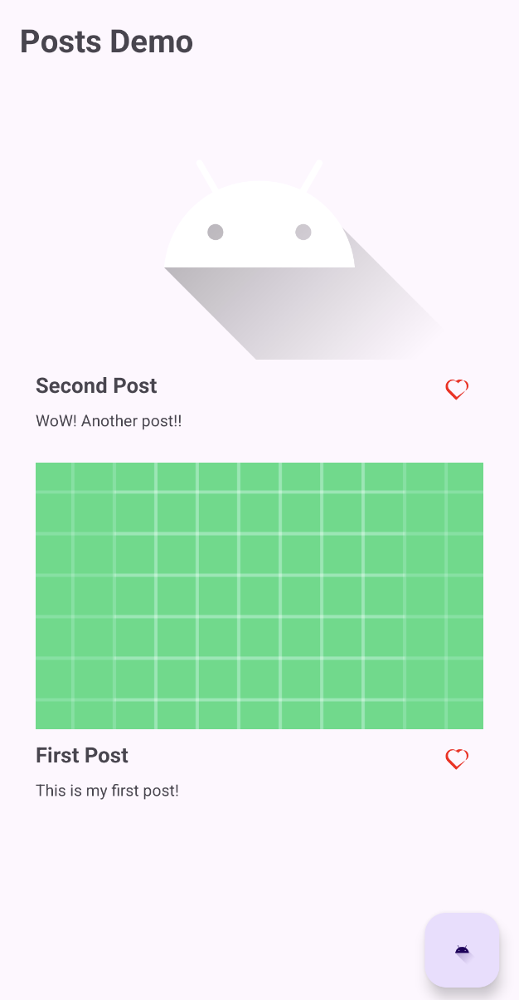
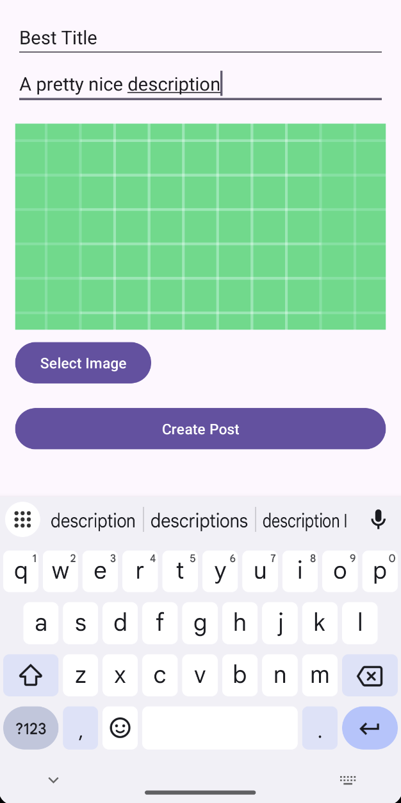
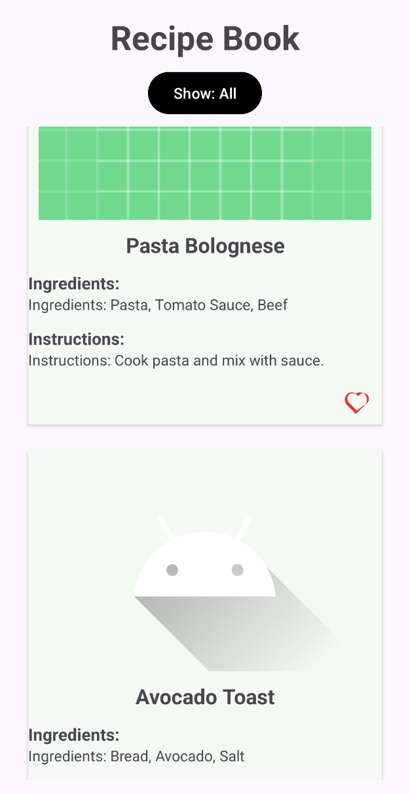
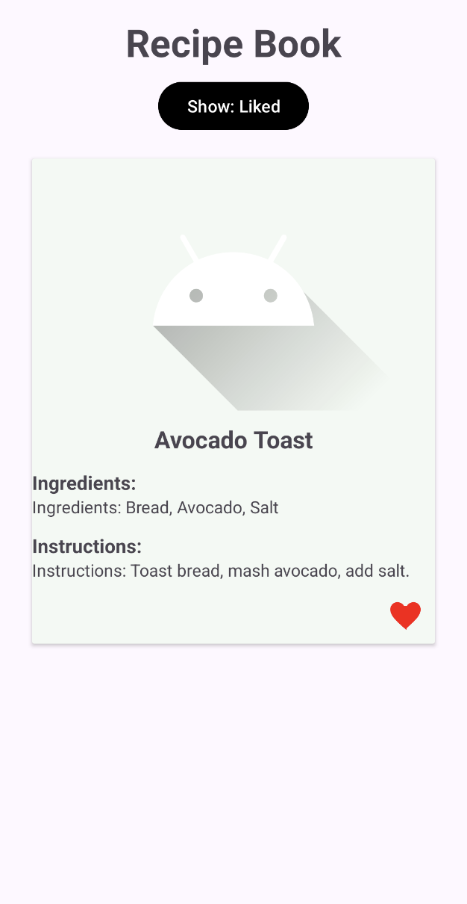

# FeedEngine + Example Apps

This repository contains a modular feed engine (`feedengine`) designed to be reused across multiple Android applications, along with two sample implementations: **MyInstagram** and **RecipeBook**.

---

## What is FeedEngine?

`feedengine` is a reusable Android library module that provides the base infrastructure for displaying a scrollable feed with support for "liking" items (or saving, bookmarking, etc.).

It includes:

- A base feed screen using `RecyclerView`  
- A like/unlike feature with visual toggle  
- Abstract base classes to reduce boilerplate for implementing custom feeds  

---

## FeedEngine Structure & Purpose

The module includes:

- `BaseFeedActivity<T>`: An abstract class that manages the core feed logic and layout lifecycle  
- `BaseFeedAdapter<T>`: A generic adapter that handles displaying a list of `LikeableItem`s  
- `LikeableItem`: An interface that your data models must implement to support liking  
- `LikeableViewHolder`: A base ViewHolder class that includes a like button and binds the `LikeableItem` state  

---

## How to Integrate FeedEngine into Your App

### 1. Add FeedEngine as a module

- Include the `feedengine` module in your Android Studio project
- In your app-level `build.gradle`, add:
`implementation project(":feedengine")`

---

### 2. Create your model class

Your model should implement LikeableItem:
```
  public class MyModel implements LikeableItem {
      private String id;
      private String title;
      private boolean isLiked;
  
      public MyModel(String id, String title) {
          this.id = id;
          this.title = title;
          this.isLiked = false;
      }
  
      @Override
      public boolean isLiked() {
          return isLiked;
      }
  
      @Override
      public void toggleLike() {
          isLiked = !isLiked;
      }
  
      public String getTitle() {
          return title;
      }
  }
```

---

### 3. Create your feed activity

Extend BaseFeedActivity<T> and override required methods:
```
public class MyFeedActivity extends BaseFeedActivity<MyModel> {
    private List<MyModel> items;

    @Override
    protected void initLayout() {
        setContentView(R.layout.activity_my_feed);
    }

    @Override
    protected List<MyModel> getFeedItems() {
        items = new ArrayList<>();
        items.add(new MyModel("1", "First Item"));
        items.add(new MyModel("2", "Second Item"));
        return items;
    }

    @Override
    protected BaseFeedAdapter createAdapter(List<MyModel> items) {
        return new MyModelAdapter(items);
    }
}
```

---

### 4. Create your adapter

Extend BaseFeedAdapter<T>:
```
public class MyModelAdapter extends BaseFeedAdapter<MyModel> {
    public MyModelAdapter(List<MyModel> items) {
        super(items);
    }

    @Override
    protected LikeableViewHolder onCreateCustomViewHolder(ViewGroup parent) {
        View view = LayoutInflater.from(parent.getContext())
            .inflate(R.layout.item_my_model, parent, false);
        return new MyModelViewHolder(view);
    }

    @Override
    protected void onBindCustomViewHolder(LikeableViewHolder holder, MyModel item) {
        ((MyModelViewHolder) holder).bind(item);
    }

    static class MyModelViewHolder extends LikeableViewHolder {
        private final TextView titleView;

        public MyModelViewHolder(View itemView) {
            super(itemView);
            titleView = itemView.findViewById(R.id.text_title);
        }

        public void bind(MyModel item) {
            titleView.setText(item.getTitle());
        }
    }
}
```

---

## Customization Options

- The like button icon is customizable — use any icon (heart, star, bookmark, etc.)  
- Modify the `LikeableViewHolder` layout XML to change icon, animation, or add actions  
- Add additional features per item (e.g., share, comment, save to favorites)

---

## Sample App: MyInstagram

A simple photo-sharing app that displays posts in a scrollable feed.

**Each post includes:**

- Title  
- Image  
- Description  
- Like button  

**Behavior:**

- Users can like/unlike posts  
- Users can create and upload new posts 
- UI updates in real time  

## Screenshots

<p align="center">MyInstagram App</p>
<p align="center">
   
   
</p>

---

## Sample App: RecipeBook

A recipe browsing app that uses FeedEngine to show recipes.

**Each recipe contains:**

- Title  
- Ingredients  
- Instructions  
- Image  
- Like (Save) button  

**Features:**

- A filter button to toggle between:
  - All recipes  
  - Liked recipes  
  - Unliked recipes  
- Maintains full state using a mutable list

## Screenshots

<p align="center">RecipeBook App</p>
<p align="center">
   
   
</p>

---

## License

This project is licensed under the MIT License. See the [LICENSE](./LICENSE) file for details.

## Contact

If you have any questions or feedback, don't hesitate to get in touch via [email](mailto:itaybit10@gmail.com).

## Note to Recruiters

Please note that this project is part of my professional portfolio. If you’re interested in my work or would like to discuss potential job opportunities, feel free to reach out via the provided email. I am open to exploring new projects and opportunities.
